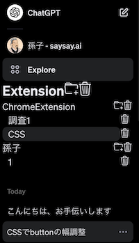

# ChatGPT Extension

ブラウザ版 ChatGPT で履歴の整理をしたい人向けのツール

## 基本事項

- 会話を木構造で管理できます。
- このツールは OpenAI の API を直接叩くことはありません。
- 木構造はあなたの使うすべての端末で共有されるはずですが、未テストです。

## 動作

- このアプリが管理している木構造に登録されていない会話を開いたら登録画面が走ります。
- 会話は HTML としてすでに読み込まれていないと適切に遷移できません。会話の数が多い場合、スクロールして HTML をロードして下さい。また、会話が期限終了などで削除された場合ももちろん遷移できません。
- 表示やらなんやら即席なのでご容赦ください。

## 導入方法

### 制作物をそのまま使う場合

1. git clone または download します。
2. (オプション ソースコードから作りたい場合、`npm run build`)
3. chrome 拡張ツールの設定で「パッケージ化されていない拡張機能を読み込む」で`/dist`を選択します。

# dev

see https://crxjs.dev/vite-plugin/

- TypeScript + React
